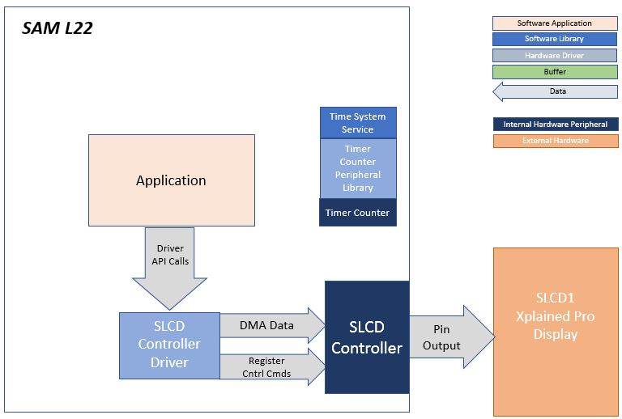
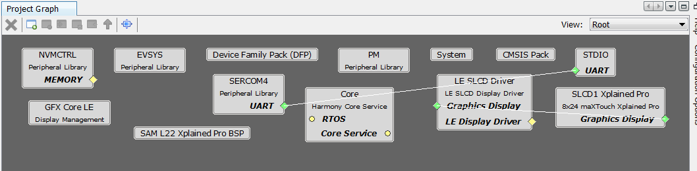
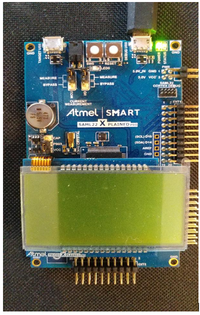

 segmented_qs_l22_slcd1_xpro.X

Defining the Architecture
-------------------------

The quickstart demonstration for the SAM L22 Xplained Pro evaluation kit is a hardware and software reference to evaluate the ATSAML22N18A microcontroller. The SAM L22 Xplained Pro kit will be used to run the quickstart application. This application demonstrates character mapping feature using the slcd segmented display driver.

### Demonstration Features

-   Character mapping
-   Component integration
-   Reference

Creating the Project Graph
--------------------------

The Project Graph diagram shows the Harmony components that are included in this application. Lines between components are drawn to satisfy components that depend on a capability that another component provides.

The project adds the **SAM L22 Xplained Pro BSP**, **SLCD Driver**, and **SLCD1 Xplained Pro** components needed for the character mapping solution.

Building the Application
------------------------

The parent directory for this application is harmony_gfx_apps_sam_l22/quickstart. To build this application, use MPLAB X IDE to open the harmony_gfx_apps_sam_l22/quickstart/firmware/segmented_qs_l22_slcd1_xpro.X project file.

The following table lists configuration properties:

|Project Name|BSP Used|Graphics Template Used|Description|
|:-----------|:-------|:---------------------|:----------|
|segmented_qs_l22_slcd1_xpro.X|SAM L22 Xplained Pro BSP | n/a | SAM L22 Xplained Pro w/ SLCD1 Xplained Pro Extension Kit 
|

> \*\*\_NOTE:\_\*\* This application may contain custom code that is marked by the comments // START OF CUSTOM CODE ... and // END OF CUSTOM CODE. When using the MPLAB Harmony Configurator to regenerate the application code, use the "ALL" merging strategy and do not remove or replace the custom code.

Configuring the Hardware
------------------------

This SAM L22 Xplained Pro evaluation kit allows connecting to the SLCD1 Xplained Pro extension board via the on-board segement LCD connector.

To explore more about SAM L22 Xplained Pro hardware, refer [datasheet](http://atmel-studio-doc.s3-website-us-east-1.amazonaws.com/webhelp/GUID-5B592B41-8D61-4438-A396-A033B73F5385-en-US-8/index.html) and [SLCD1](http://ww1.microchip.com/downloads/en/DeviceDoc/Atmel-42558-Touch-SLCD1-Xplained-Pro_User-Guide.pdf).

The final hardware setup should be:

Running the Demonstration
-------------------------

When power-on is successful, the demonstration will display characters as illustrated below:

* * * * *
