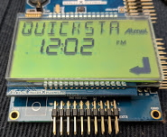

# Segmented Quickstart

This demonstration provides a segmented display starting point for segmented display customers.

|MPLABX Configuration|Board Configuration|
|:-------------------|:------------------|
|[segmented_qs_l22_slcd1_xpro.X](./firmware/segmented_qs_l22_slcd1_xpro.X/readme.md)|[SAM L22 Xplained Pro Evaluation Kit](https://www.microchip.com/developmenttools/ProductDetails/PartNO/ATSAML22-XPRO-B) using USART to drive the [SLCD1 Xplained Pro Extension Kit](https://www.microchip.com/DevelopmentTools/ProductDetails/PartNO/ATSLCD1-XPRO)|

